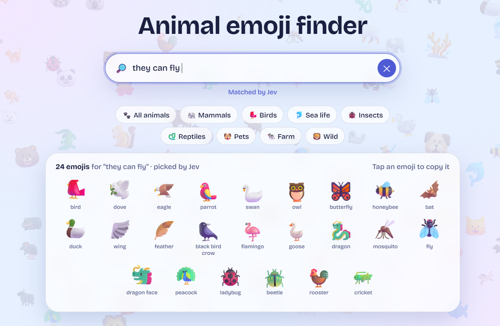
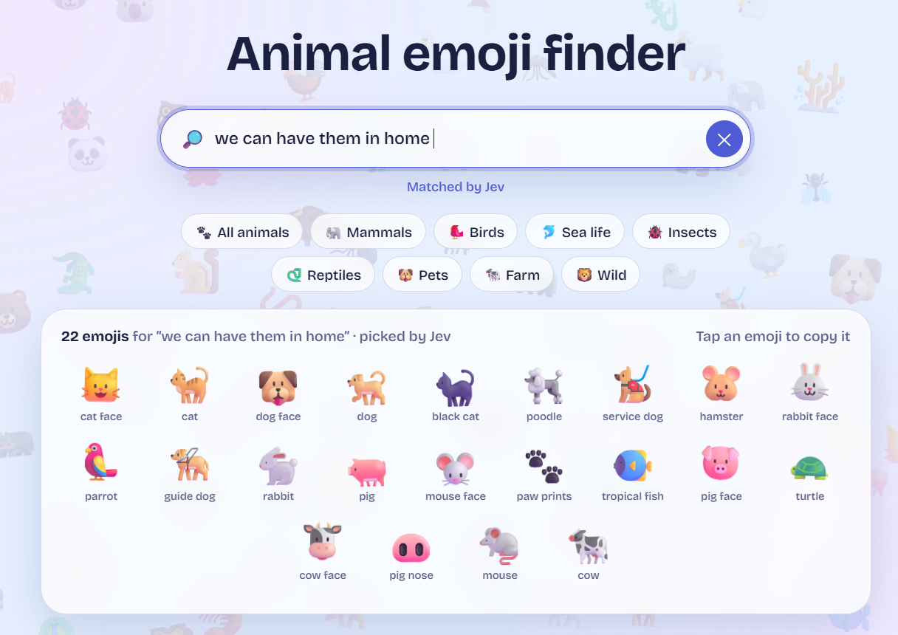
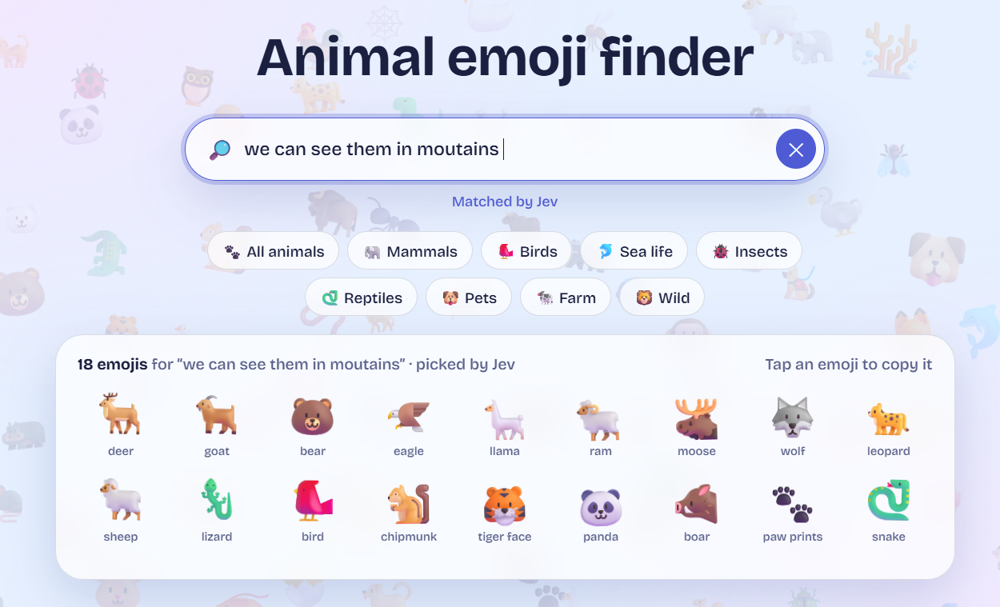

<h1 align="center">🦁 Animal Emoji Finder</h1>

<p align="center">
  Every animal emoji floating on one page. Search in plain English, let Jev AI pick the matches, and click any emoji to copy it.
</p>

## Demo

<p align="center">
  <video src="./pictures/demo.mp4" width="100%" controls autoplay loop muted playsinline></video>
</p>


<p align="center">
  
</p>

<p align="center">
  
</p>

<p align="center">
  
</p>

## Contents

- [Features](#features)
- [What's in the box](#whats-in-the-box)
- [Quick start](#quick-start)
- [Using the app](#using-the-app)
- [How the search works](#how-the-search-works)
- [Privacy and security](#privacy-and-security)

## Features

- **128 animal emojis** floating around the screen, with the search bar in the middle.
- **Plain-English search.** Ask for `birds`, `sea animals` or `animals that fly`, and the matching emojis gather in a panel below the search bar.
- **Powered by Jev**, TypeSafe AI's decision model, with a **built-in fallback search** so the app never stops working.
- **Click to copy.** Click any emoji, floating or in the results panel.
- **Friendly search.** The fallback understands Persian names, ignores small typos, and combines groups with `and` or commas.
- **Light and dark themes** that follow your system setting.
- **Private by design.** With the included server, your API key never reaches the browser.

## What's in the box

| File | What it does |
| --- | --- |
| `index.html` | The whole app: page, styles and search logic in one file. |
| `server.js` | A tiny local server that serves the page and passes searches to Jev, keeping your API key private. |
| `pictures/` | The screenshots shown at the top of this README. |
| `.env` | You create this. It holds your API key (see below). It is never uploaded to GitHub. |
| `.gitignore` | Tells git to skip `.env` and other files that shouldn't be uploaded. |

## Quick start

You need [Node.js](https://nodejs.org) 18 or newer. There is nothing to install with npm.

1. Put `index.html` and `server.js` in the same folder.
2. In that folder, create a text file named exactly `.env` containing one line:

   ```
   TYPESAFE_API_KEY=your_key_here
   ```

   On Windows with Notepad, choose **Save as**, set the type to **All files**, and type `.env` as the name.
3. Open a terminal in that folder and run:

   ```
   node server.js
   ```
4. Open <http://localhost:3000> in your browser.

To use a different port, set `PORT` (for example `PORT=8080`) in the `.env` file.

### Other ways to provide the key

You can skip the `.env` file and set the key in your terminal instead.

| Terminal | Command |
| --- | --- |
| Windows Command Prompt | `set TYPESAFE_API_KEY=your_key_here` then `node server.js` (two separate lines) |
| Windows PowerShell | `$env:TYPESAFE_API_KEY="your_key_here"; node server.js` |
| macOS / Linux | `TYPESAFE_API_KEY=your_key_here node server.js` |

### Without the server

You can open `index.html` directly in your browser instead. Click the ⚙️ button in the top-right corner, paste your key, and save. The key is stored only in your browser. Some browsers block direct calls to the API, and if that happens the page tells you so. In that case, use `server.js`.

Without a key, the app still works using its built-in search.

## Using the app

- **Search box:** type a request and wait half a second, or press **Enter** to search immediately. Press **Esc** to clear.
- **Quick buttons:** All animals, Mammals, Birds, Sea life, Insects, Reptiles, Pets, Farm and Wild.
- **Copy an emoji:** click any emoji, floating or in the results panel.
- **Status line:** shows what happened, for example "Matched by Jev" or a warning if Jev didn't answer.

Things worth trying: `all the animals`, `birds`, `birds and fish`, `pets`, `animals that live in the ocean`, `dangerous animals`, `insects`.

## How the search works

1. Your text is sent to Jev as the search request.
2. The page asks Jev one yes/no question per emoji: "Should this emoji appear for this request?" With 128 emojis, that is 4 requests of 35 questions each, sent in parallel.
3. Jev returns a probability for each question. Emojis at 50% or higher are shown, best matches first.
4. Results are cached, so repeating a search costs nothing.

Searches that already match every animal, such as `all the animals`, skip Jev and show everything at once.

**Built-in fallback search** is used when there is no key or Jev doesn't answer. It matches emoji names, animal groups and Persian names, ignores small typos, and understands `and` or commas to combine groups.

## Privacy and security

- Never share your `.env` file or your API key, and don't put them in a public repository. If you use git, add `.env` to `.gitignore`.
- With `server.js`, the key stays on your computer and never reaches the browser.
- If you save the key in the ⚙️ settings, it is stored in your browser's local storage. Don't do that on a shared computer.
- The text you type is sent to Jev to find matches. Nothing else leaves your computer.
